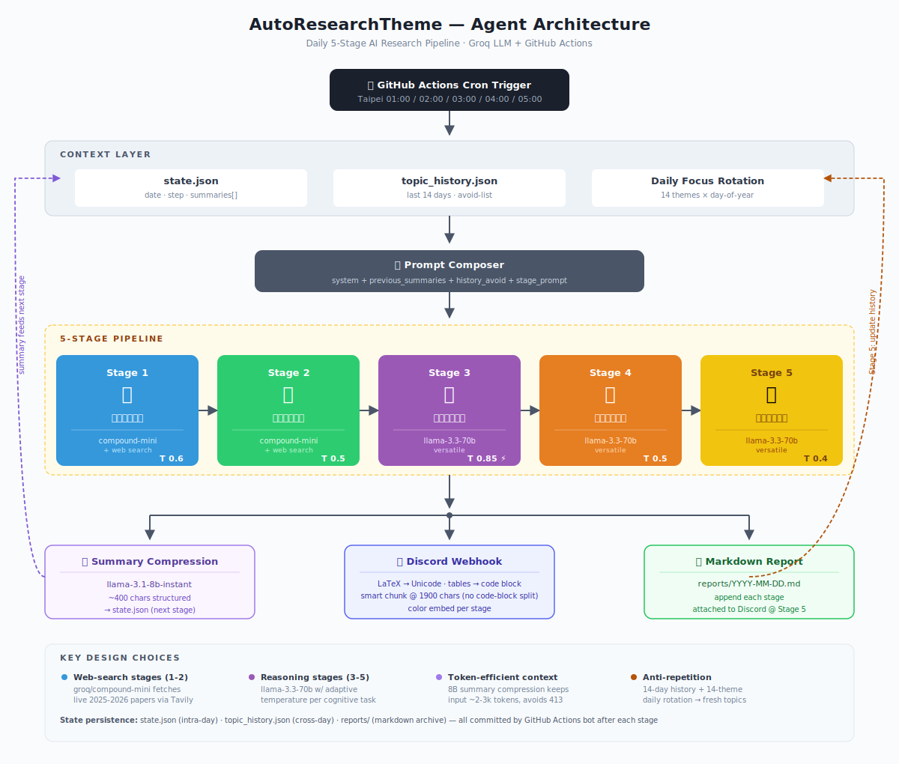

# AutoResearchTheme — AI 自動研究議題助理

每天凌晨自動完成 **「探索議題 → 深挖方法 → 創新發想 → 自我批判 → 完整提案」** 的 5 階段研究循環,並將每階段結果即時推送到 Discord。

底層使用 Groq LLM API + GitHub Actions cron 排程,在 Groq 與 GitHub free tier 內可長期運作。

---

## 系統架構



---

## 核心特色

- **5 階段 pipeline** 模擬研究員從找題目到寫提案的完整思考過程
- **三模型分工**:web search 用 `groq/compound-mini`、推理用 `llama-3.3-70b-versatile`、摘要壓縮用 `llama-3.1-8b-instant`
- **議題不重複**:`topic_history.json` 記錄過去 14 天主題,自動注入 Stage 1 prompt 當作禁區
- **每日輪替焦點**:14 個前沿子領域(mechanistic interp、SSM、RLVR、world models、continual learning、discrete diffusion、AI for Science 等)以 day-of-year 輪選,徹底避免議題慣性
- **Discord 格式安全**:自動把 LaTeX 公式轉 Unicode、把 markdown 表格包進 code block、智慧分塊不切斷 code block
- **跨階段省 token**:每階段用 8B 模型壓成 ~400 字摘要傳給下一階段,input token 恆定 ~2-3k,徹底避開 free tier 的 413 限制
- **每階段自適應 temperature**:創新階段 0.85 鼓勵跳躍、批判與整合階段 0.4-0.5 確保嚴謹

---

## 排程

`cron: 0 17,18,19,20,21 * * *` (UTC) = 台灣時間 **01:00, 02:00, 03:00, 04:00, 05:00**

| Stage | 台灣時間 | 內容 | 模型 | Temperature |
|:-----:|:--------:|------|------|:-----------:|
| 1 | 01:00 | 🔍 探索熱門議題 | compound-mini (web search) | 0.6 |
| 2 | 02:00 | 📖 深入相關方法 | compound-mini (web search) | 0.5 |
| 3 | 03:00 | 💡 提出創新方法 | llama-3.3-70b-versatile | 0.85 ⚡ |
| 4 | 04:00 | 🔥 嚴格自我批判 | llama-3.3-70b-versatile | 0.5 |
| 5 | 05:00 | ✅ 完整研究提案 | llama-3.3-70b-versatile | 0.4 |

所有 stage 都落在同一個台灣日期內,不會跨日導致 state 被誤判重置。1 小時間距為 GitHub Actions 延遲預留充足 buffer。

---

## 檔案結構

```
AutoResearchTheme/
├── .github/workflows/research_agent.yml   # GitHub Actions 排程
├── reports/                               # 每日完整報告(自動產生)
├── architecture.svg                       # 架構圖
├── state.json                             # 當日狀態(跨日自動重置)
├── topic_history.json                     # 過去 14 天主題歷史(自動產生)
├── agent.py                               # 主程式
├── requirements.txt
└── README.md
```

---

## 部署

1. **取得 API Keys**
   - Groq API Key:[console.groq.com/keys](https://console.groq.com/keys)
   - Discord Webhook URL:頻道設定 ⚙️ → 整合 → Webhooks → 新增

2. **建立 Private GitHub Repo** 並推上所有檔案

3. **加入 Secrets**(Settings → Secrets and variables → Actions):
   - `GROQ_API_KEY`
   - `DISCORD_WEBHOOK_URL`

4. **開啟寫權限**:Settings → Actions → General → Workflow permissions → **Read and write**

5. **手動測試**:Actions 頁 → *Daily Research Agent* → **Run workflow**,連續觸發 5 次驗證完整 pipeline

---

## 自訂

| 想改的東西 | 改哪裡 |
|------------|--------|
| Stage prompt | `agent.py` 內 `build_stage_prompts()` |
| 每日輪替的焦點主題 | `agent.py` 內 `DAILY_FOCUS_THEMES` |
| 議題避免重複的天數 | `agent.py` 內 `HISTORY_DAYS` |
| 回應長度上限 | `MAX_TOKENS_MAIN` / `MAX_TOKENS_SUMMARY` |
| 使用的模型 | `MODEL_RESEARCH` / `MODEL_REASONING` / `MODEL_SUMMARY` |
| 每階段 temperature | `STAGE_TEMPERATURE` |
| 手動重置今日進度 | 刪除 `state.json` |

---

## 成本

一天 5 階段約 **< $0.005 USD**,Groq 與 GitHub Actions 的 free tier 完全夠用。

---

## 授權

個人用途範本,可自由 fork 修改。
